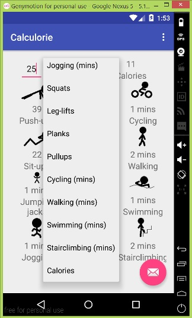
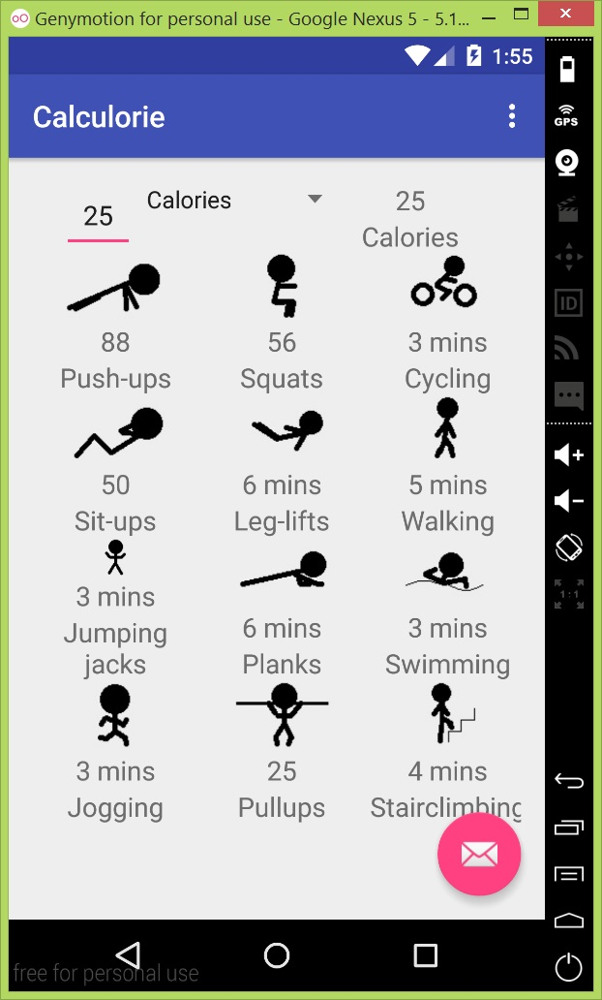

# PROG 01: Crunch Time

My calorie calculator project, designed to emphasize simplicity and ease of use. The user gives how much of what exercise they did, and gets feedback on calories burned and alternative exercise equivalents on a simple visual template.

## Authors

Richard Hu ([rhu@berkeley.edu](mailto:rhu@berkeley.edu))

## Demo Video

See [CS160 Prog01] (https://youtu.be/qPwgP6ecU3A
)

## Screenshots

## Acknowledgments

* Stack Overflow
* Android Studio
* Anyone tolerant of my terrible MSPaint skills

*Feel free to enhance your README. For Markdown syntax, see [the GitHub Guides](https://guides.github.com/features/mastering-markdown/). Remove this line in your submission.*
